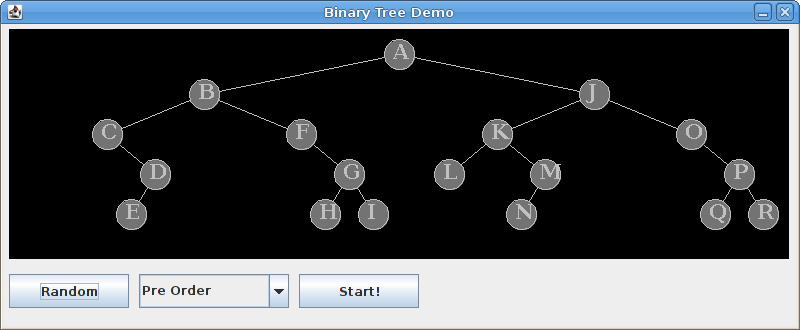

### Binary tree traversal algorithms

--- --- --- --- --- --- --- --- --- --- --- --- --- --- --- --- --- --- --- --- --- --- --- ---

In this lab you will implement several binary tree traversal algorithms.

**Note:** Because a binary tree is a recursive data structure, most binary tree algorithms can be expressed best 
recursively.  In this assignment, all of the code you will write will be recursive, with the exception of the 
implementation of the **LevelOrder** class.


<br>

### Getting Started

--- --- --- --- --- --- --- --- --- --- --- --- --- --- --- --- --- --- --- --- --- --- --- ---

Download [CS350_Lab06.zip](CS350_Lab06.zip) and import it into your Eclipse workspace.  
(**File → Import... → General → Existing Projects into Workspace → Archive File**).  You should see a new project, 
CS350_Lab06, in the package explorer.


<br>

### Preliminaries

--- --- --- --- --- --- --- --- --- --- --- --- --- --- --- --- --- --- --- --- --- --- --- ---

The **```BinTreeNode```** interface describes the methods which may be performed on the nodes of a binary tree.  
These methods are:

* **```void setLeft(BinTreeNode left)```** - set the given node as the left sub-tree
* **```void setRight(BinTreeNode right)```** - set the given node as the right sub-tree
* **```BinTreeNode getLeft()```** - get the left sub-tree
* **```BinTreeNode getRight()```** - get the right sub-tree


You will use these methods to create and traverse binary trees.

The **```BinTreeNodeVisitor```** interface defines several methods which you should use when traversing the nodes of 
a binary tree:

* **```void start(BinTreeNode node)```** - call this method when your traversal algorithm arrives at a node for the first time
* **```void visit(BinTreeNode node)```** - call this method to visit the given node
* **```void finish(BinTreeNode node)```** - call this method when your traversal is completely finished with the node


In general, a recursive traversal algorithm should call **```start```** when encountering a node for the first time, 
near the entry to the recursive visitation method.  It should call **```visit```** to "officially" visit the node.  
Finally, it should call **```finish```** when it is completely done with the node, typically just before returning from 
the recursive visitation method.


<br>

### Traversal algorithms

--- --- --- --- --- --- --- --- --- --- --- --- --- --- --- --- --- --- --- --- --- --- --- ---

You will implement several classes used by the **```TreeDemo```** class, which is a Java GUI application that animates 
several binary tree traversal algorithms.  You can run the **```TreeDemo```** program at any time by right-clicking on 
"TreeDemo.java" in the Package Explorer and choosing "**Run As → Java Application**".

Click the "Random" button.  You should see a tree that looks something like the following:



You task is to implement several binary tree traversal algorithms.  These algorithms will visit each node in the 
binary tree.

In each traversal, you will need to use the methods of the **```BinTreeNodeVisitor```** object passed to the traversal 
method to record the various stages of visitation (start, visit, finish) at each node.  **```start```** should be called 
immediately upon reaching a node for the first time.  **```visit```**, as the name implies, is the "official" visitation 
of the node.  **```finish```** should be called after visiting the node and recursively visiting its subtrees.  Note 
that in the case of level-order traversal, which is not recursive, you can just call start, visit, and finish in 
succession on each node you reach.

You will need to handle the base case where one or both of the sub-trees of a node are null.

To test one of your traversal algorithms, run **```TreeDemo```**, create a random tree, select the algorithm name from 
the combo box, and click "Start!".

The **```PreOrder```** class implements a Pre-Order traversal.  A Pre-Order traversal visits the node, recursively 
traverses the left sub-tree, and then recursively traverses the right sub-tree.

The **```PostOrder```** class implements a Post-Order traversal.  A Post-Order traversal recursively traverses the left 
sub-tree, recursively traverses the right sub-tree, then visits the node.

The **```InOrder```** class implements an In-Order traversal.  A In-Order traversal recursively traverses the left 
sub-tree, visits the node, and then recursively traverses the right sub-tree.

The **```LevelOrder```** class implements a Level-Order traversal.  A Level-order traversal first visits the root, then 
each child of the root, then each grand-child, etc.  Unlike the other traversals, Level Order is not defined recursively.  
Instead, you should use a queue to keep track of the next node to be visited.  The algorithm for level order visitation 
is as follows:


```java
create a queue
enqueue the root node
while the queue is not empty {
    dequeue a node
    start, visit, and finish the node
    enqueue each child of the node
}
```


You may use a **```java.util.LinkedList```** object as a queue.  Create the linked list as follows:

```java
Queue<BinTreeNode> queue = new LinkedList<BinTreeNode>();
```


The **```isEmpty```** method returns whether or not the queue is empty.  Use the **```add```** method to enqueue a node 
and the **```remove```** method to dequeue a node.

Level-Order traversal is also known as "Breadth First Search".  When you run the animation for this traversal, it 
should be clear why.
